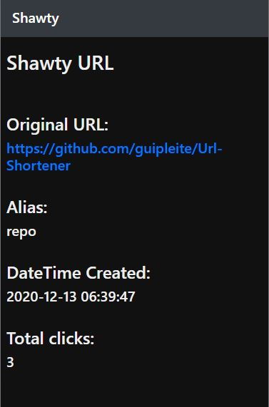

# Url-Shortener
Simple URL Shortener  built with Node.js, Vue and MongoDB.

There are two main pages, the initial one where the shortened URLs are created and the second one that gives some information about the alias.

 

